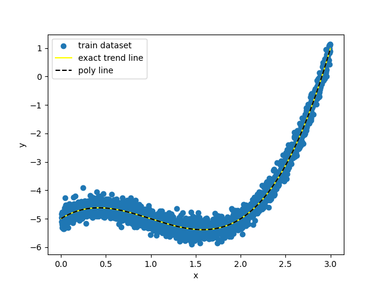
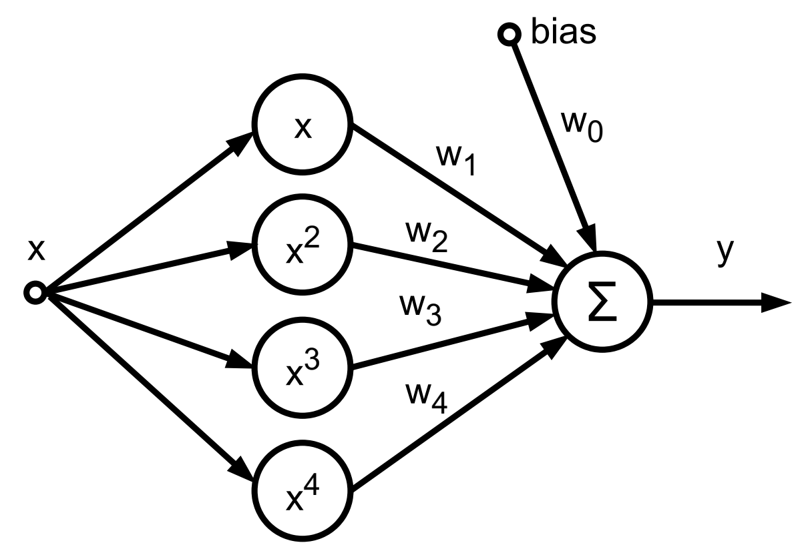
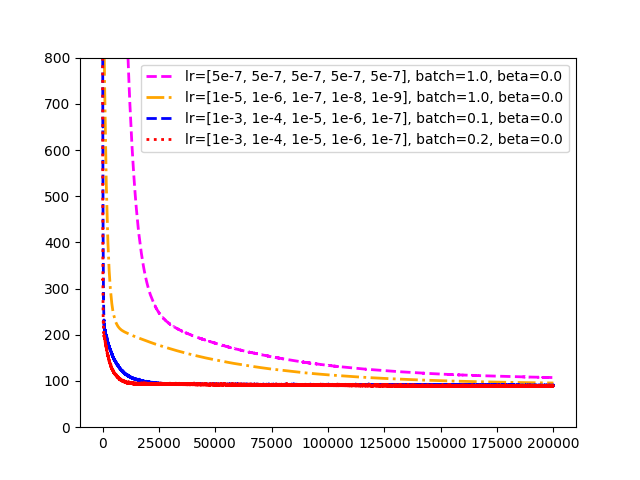
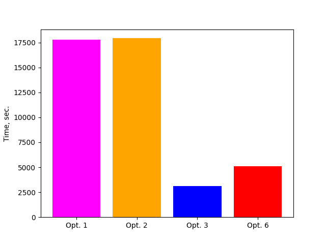
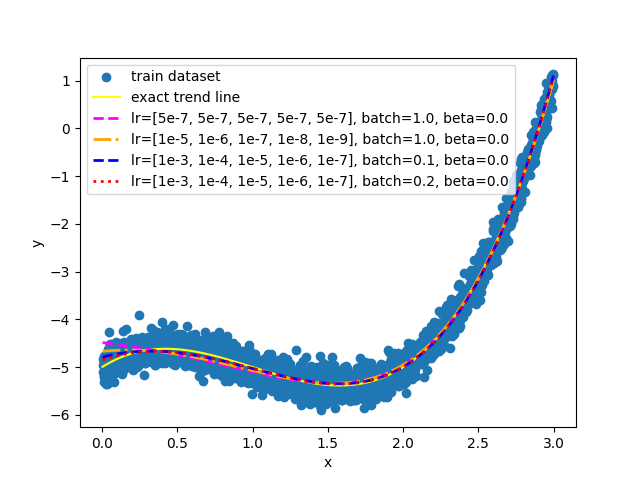

# Задача поиска оптимальных коэффициентов полиномиальной модели методом градиентного спуска

## Notebooks
- 'grad_method.ipynb' - разбираемся как работать с __[numpy.gradient](https://numpy.org/doc/2.0/reference/generated/numpy.gradient.html#numpy-gradient)__.
- 'ML_2.ipynb' - основной файл.

## Набор данных
Сгенерирован датасет синтетических данных размера ${N=2000}$.

В основу генерации положена полиномиальная функция с добавлением случайного шума ${\epsilon}$

${f(x) = \sum_{k=0}^{K-1}{w_k \cdot x^k} + \epsilon}$,

где ${w=[w_0, w_1, ..., w_{K-1}]}$ - массив весов размера ${K}$.

Итоговый датасет [x, y] сгенерирован для ${x \in [0; 3]}$ при следующих весах:
${w=[-5, 2, -3, 1]}$ ${(K=4)}$.

## Постановка задачи
Необходимо найти веса модели, представленной на рисунке ниже.
Количество весов принято большим на одно ${(K=5)}$, в ожидание получить нулевое значение этого искусственно добавленного коэффициента.

## Метод решения
Поиск коэффициентов осуществлятся путем минимизации функции потерь.

${loss(w) = \sum \left(y_i - \bar{y}_i(w) \right)^2}$

Минимизация методом градиентного спуска.

Ожидаемые значения весов: ${w=[-5, 2, -3, 1, 0]}$.

В целях ускорения сходимости метода исследованы следующие гиперпараметры:

- Шаг обучения (learning rate).
- Размер тренировочной выборки (batch size).
- Постоянная $\beta$ фильтра градиентов (Momentum):

${G_n = \beta G_{n-1} + (1 - \beta)grad_n}$

Градиент вычислялся численно, с помощью __[numpy.gradient](https://numpy.org/doc/2.0/reference/generated/numpy.gradient.html#numpy-gradient)__.

## Темп сходимости
На графиках ниже представлены 4 наиболее репрезентативных варианта набора гиперпараметров и соответствующая им столбчатая диаграмма времени вычисленияй. Время вычисления измерялось __[time.time()](https://docs.python.org/3/library/time.html)__

## Результаты
Среди определенных значений весов ближайшие к эталонным достигнуты при параметрах
learning rate=[1e-3, 1e-4, 1e-5, 1e-6, 1e-7],
batch=0.2,
beta=0.0.

Потребовалось 200 тыс. итераций.

Значения весов следующие:
w=[-4.8463  1.0719 -1.7345  0.3845  0.0983]

## Выводы
1. 'Learning rate' - ключевой параметр, влияющий на скорость обучения (темп сходимости).
1. В задачах, когда у минимизируемой функции чувствительность к параметрам не одинакова (как в случае рассмотренной) имеет смысл задавать 'learning rate' индивидуальный для каждого искомого параметра: чем больше чувствительность функции к параметру, тем меньше 'learning rate'.
1. Выполняя оптимизацию не на полном датасете (разбиением на батчи) удается обеспечивать устойчивость метода при больших значениях 'learning rate'. Тем не только улучшается как темп сходимости, но и снижается продолжительность обучения за счет меньшего числа вычислительных операций на каждом шаге.
1. Фильтрация градиента (Momentum) оказалась бесполезной в этом частном случае функции потерь.